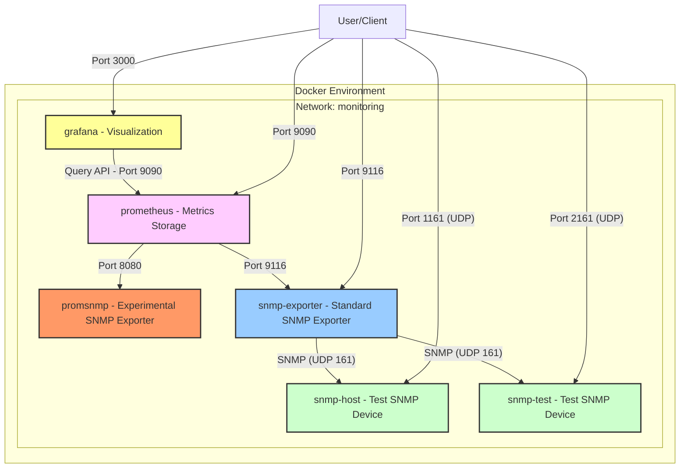

# SNMP Monitoring Test Bed

A development and testing environment for building a replacement for the Prometheus SNMP Exporter.

## Overview

This project provides a Docker-based test environment specifically designed for developing and testing a new SNMP metrics collection solution. The current Prometheus SNMP Exporter has limitations that this project aims to address by creating a more flexible and powerful alternative.

The test bed includes:

- Prometheus for metrics storage and querying
- Grafana for metrics visualization
- The standard SNMP Exporter (for comparison)
- Two simulated SNMP devices for testing
- PromSNMP - an experimental replacement for the standard SNMP Exporter

## Purpose

The primary goals of this test bed are to:

1. Provide a controlled environment for developing and testing a new SNMP exporter
2. Allow side-by-side comparison with the standard Prometheus SNMP Exporter
3. Test different SNMP collection strategies and optimizations
4. Validate metrics accuracy and performance against test SNMP devices

## Architecture Diagram


## Project Setup

This project uses Git submodules to integrate the PromSNMP development with the test bed environment.

### Initial Setup

1. Clone this repository with submodules
```bash
git clone --recurse-submodules <repository-url>
cd <repository-directory>
```

2. If you've already cloned the repository without `--recurse-submodules`:
```bash
git submodule init
git submodule update
```

For detailed submodule management instructions, see [Git Submodule Setup Instructions](submodule-setup.md).

## Components

### PromSNMP

The project builds the latest version of the PromSNMP project into a container to be used to test against.

### Test SNMP Devices

Two test SNMP devices (`snmp-host` and `snmp-test`) are included to provide consistent and controlled data sources for testing. They use custom SNMP configurations.

### Prometheus & Grafana

Standard monitoring tools are included to validate the collected metrics and provide visualization capabilities.

## Prerequisites

- Docker and Docker Compose
- Understanding of SNMP, MIBs, and OIDs
- Familiarity with Prometheus exporters and metrics

## Build PromSNMP with docker
### Building with Docker

For convenience, a build script is provided to handle the Docker-based Maven build process:

```bash
# Make the script executable
chmod +x build-with-docker.sh

# Run the build script
./build-with-docker.sh
```

This script builds the PromSNMP project using Maven in a Docker container
No local Java or Maven installation is required.

## Quick Start

1. Clone this repository
```bash
git clone <repository-url>
cd <repository-directory>
```

2. Start the entire stack
```bash
docker-compose up -d
```

3. Access the services:
   - Prometheus: http://localhost:9090
   - Grafana: http://localhost:3000 (default credentials: admin/admin)
   - Standard SNMP Exporter: http://localhost:9116
   - PromSNMP (experimental): http://localhost:8080/promSnmp/sample

## Configuration Files

### SNMP Configuration (snmp.yml)

This file configures the standard SNMP Exporter, defining which metrics to collect:

```yaml
modules:
  localhost:
    walk:
      - sysUpTime
      - sysContact
      - sysName
      - sysLocation
      - ifTable

auths:
  public_v2:
    community: public
    security_level: noAuthNoPriv
    auth_protocol: MD5
    priv_protocol: DES
    version: 2
```

### Prometheus Configuration (prometheus.yml)

Configures Prometheus to scrape both the standard SNMP Exporter and the experimental PromSNMP.

## Grafana Setup

### Adding Prometheus as a Data Source

1. Open Grafana at http://localhost:3000 (default login: admin/admin)
2. Navigate to Configuration > Data Sources
3. Click "Add data source"
4. Select "Prometheus"
5. Set the URL to `http://prometheus:9090` (use the internal Docker network name)
6. Leave other settings as default
7. Click "Save & Test" to verify the connection

### Creating Dashboards for Testing

1. Navigate to Dashboards > New > New Dashboard
2. Click "Add visualization"
3. Select the Prometheus data source
4. Use PromQL queries to compare metrics between the standard and experimental exporters:
   ```
   snmp_scrape_duration_seconds{} # Standard exporter
   promsnmp_scrape_duration_seconds{} # Experimental exporter
   ```
5. Save the dashboard for ongoing testing and comparison

## Development Workflow

1. **Make changes** to your experimental SNMP exporter code
2. **Build and deploy** an updated Docker image
3. **Update** the `promsnmp` service in `docker-compose.yaml` to use the new image
4. **Restart the service**:
   ```bash
   docker-compose up -d promsnmp
   ```
5. **Compare metrics** between the standard SNMP Exporter and your experimental version
6. **Analyze** performance, accuracy, and capabilities

## Testing Methods

### Metric Comparison

Use Prometheus's query language (PromQL) to compare metrics between the standard exporter and your experimental one.

Example:
```
rate(snmp_scrape_duration_seconds[5m]) vs. rate(promsnmp_scrape_duration_seconds[5m])
```

### Performance Testing

1. Add additional SNMP devices or increase the number of metrics
2. Measure scrape durations, CPU usage, and memory consumption

## SNMP Device Configuration

The test SNMP devices are configured using custom configuration files:

- `mysnmpd.conf` for `snmp-host`
- `testsnmpd.conf` for `snmp-test`

These configurations can be modified to test different SNMP scenarios, OID structures, and error conditions.

## Future Development

## Troubleshooting

### Verifying SNMP Connectivity

```bash
docker exec -it snmp-exporter snmpwalk -v 2c -c public snmp-host:161 system
```

### Comparing Metric Output

Standard SNMP Exporter:
```bash
curl http://localhost:9116/snmp?target=snmp-host&auth=public_v2&module=if_mib
```

Experimental PromSNMP:
```bash
curl http://localhost:8080/promSnmp/sample
```

## Contributing

## License

This project is licensed under the MIT License - see below for details:

```
MIT License

Copyright (c) 2025

Permission is hereby granted, free of charge, to any person obtaining a copy
of this software and associated documentation files (the "Software"), to deal
in the Software without restriction, including without limitation the rights
to use, copy, modify, merge, publish, distribute, sublicense, and/or sell
copies of the Software, and to permit persons to whom the Software is
furnished to do so, subject to the following conditions:

The above copyright notice and this permission notice shall be included in all
copies or substantial portions of the Software.

THE SOFTWARE IS PROVIDED "AS IS", WITHOUT WARRANTY OF ANY KIND, EXPRESS OR
IMPLIED, INCLUDING BUT NOT LIMITED TO THE WARRANTIES OF MERCHANTABILITY,
FITNESS FOR A PARTICULAR PURPOSE AND NONINFRINGEMENT. IN NO EVENT SHALL THE
AUTHORS OR COPYRIGHT HOLDERS BE LIABLE FOR ANY CLAIM, DAMAGES OR OTHER
LIABILITY, WHETHER IN AN ACTION OF CONTRACT, TORT OR OTHERWISE, ARISING FROM,
OUT OF OR IN CONNECTION WITH THE SOFTWARE OR THE USE OR OTHER DEALINGS IN THE
SOFTWARE.
```